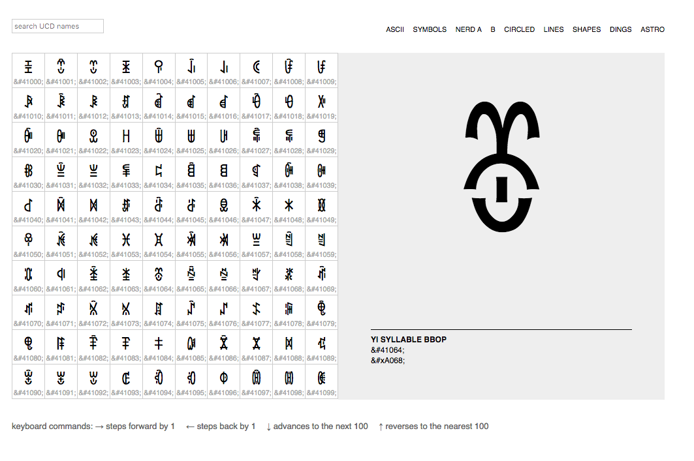
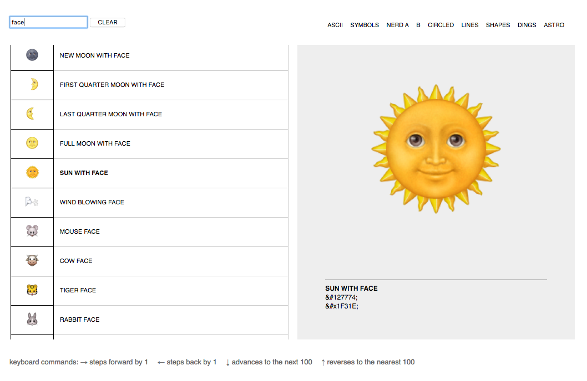

# unicode-table

`unicode-table` is a plain-vanilla, no-dependencies port of Paul Ford's [Unicode table for you](http://www.ftrain.com/unicode-table.html).

It doesn't have sliders but it does have keyboard commands and rudimentary search. Also, more recent versions of Unicode.

## Pictures or it didn't happen

### Browsing

### Searching

## Important

This is still wet paint.

## See also

* http://www.ftrain.com/unicode-table.html
* https://github.com/whosonfirst/go-ucd/
