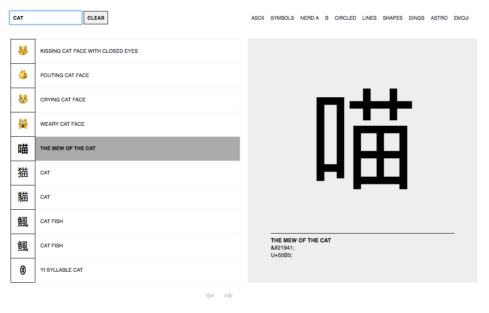
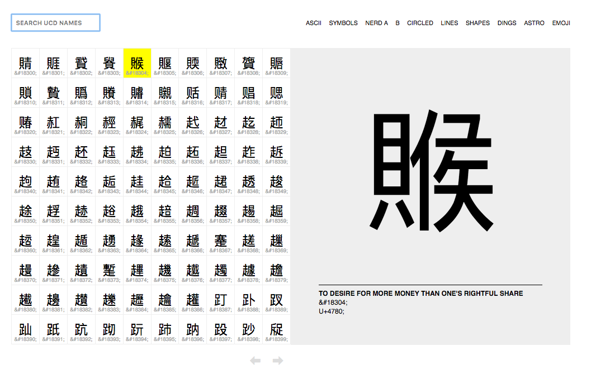
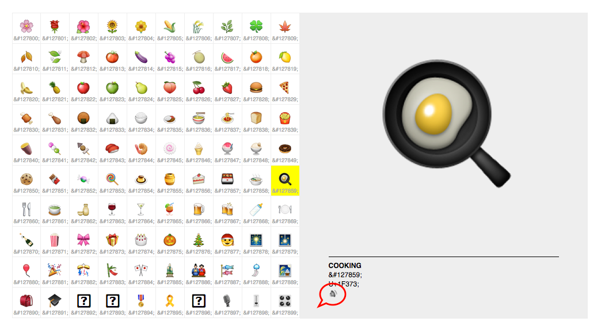

# unicode-table

`unicode-table` is a plain-vanilla, no-dependencies port of Paul Ford's [Unicode table for you](http://www.ftrain.com/unicode-table.html).

It doesn't have sliders but it does have keyboard commands and rudimentary search. Also, more recent versions of [Unicode](http://www.unicode.org/charts/), including [Unihan](http://www.unicode.org/charts/unihan.html).

## Demo

[https://thisisaaronland.github.io/unicode-table/](https://thisisaaronland.github.io/unicode-table/)

## Usage

First, clone this repository:

```
git clone https://github.com/thisisaaronland/unicode-table
```

### In a plain old web browser

Just open `unicode-table/www/index.html` in your web browser.

### As a standalone application

Well almost. Everything you need to run `unicode-table` as an [Electron](https://electron.atom.io/) application is included in this repository. There are a few extra steps to get it working:

You will need to have [Git](https://git-scm.com/), [Node.js](https://nodejs.org/) and [npm](https://www.npmjs.com/) installed. On a Mac these are all easy to install with the [Homebrew](https://brew.sh/) package manager. On Linux all the dependencies are available via tools like `apt` or `yum`. On Windows I'm afraid I have no idea what the state of the art is these days.

Once all the dependencies are installed:

```
# Go into the repository
cd unicode-table

# Install dependencies
npm install

# Run the app
npm start
```

You can also build your own native application with a few extra steps:

```
# Install the electron-packager utlities
npm install -g electron-packager

# Build a standalong version of unicode-table for your computer
electron-packager ./ "UnicodeTable" --icon="app_icon" --overwrite --prune
```

## Pictures or it didn't happen

### Browsing


### Searching


### Unihan





### Text to speech



["Fried egg, or cooking"](https://thisisaaronland.github.io/unicode-table/#127859)

## Important

This is still wet paint. It's not pretty under the hood or above but it works. At least for me. There are probably missing features that we both want. [Feedback is welcome.](https://github.com/thisisaaronland/unicode-table/issues)

## Where does the data come from?

Unicode and Unihan data are exported using `ucd-dump` tool which is part of the [go-ucd](https://github.com/whosonfirst/go-ucd/) package and included as a binary tool (for OS X) with this repo. The whole process is wrapped up in a handy `ucd` Makefile target, like this:

```
ucd:
	if test -f www/javascript/ucd.js.tmp; then rm www/javascript/ucd.js.tmp; fi
	touch www/javascript/ucd.js.tmp
	printf %s "var ucd=" >> www/javascript/ucd.js.tmp
	bin/darwin/ucd-dump -unihan | tr "\n\r" ";" >> www/javascript/ucd.js.tmp
	mv www/javascript/ucd.js.tmp www/javascript/ucd.js
```

_Note: The _ucd-dump_ program will generate a UCD definition for whatever its current internal mapping defines (Unicode 10.0 as of this writing). It does not pull directly dynamically from the Unicode.org website._

## What's up with the application icon?

`图` is the Unicode character for [DIAGRAM; CHART, MAP, PICTURE](https://thisisaaronland.github.io/unicode-table/#22270).

## See also

* http://www.ftrain.com/unicode-table.html
* http://www.unicode.org/charts/
* http://www.unicode.org/charts/unihan.html
* https://github.com/whosonfirst/go-ucd/
