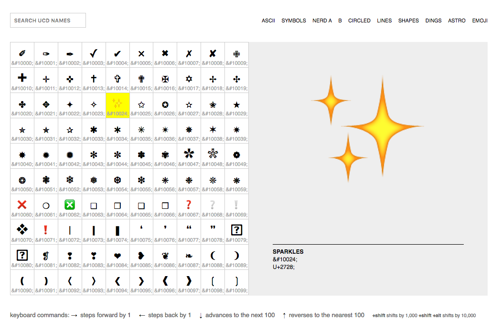
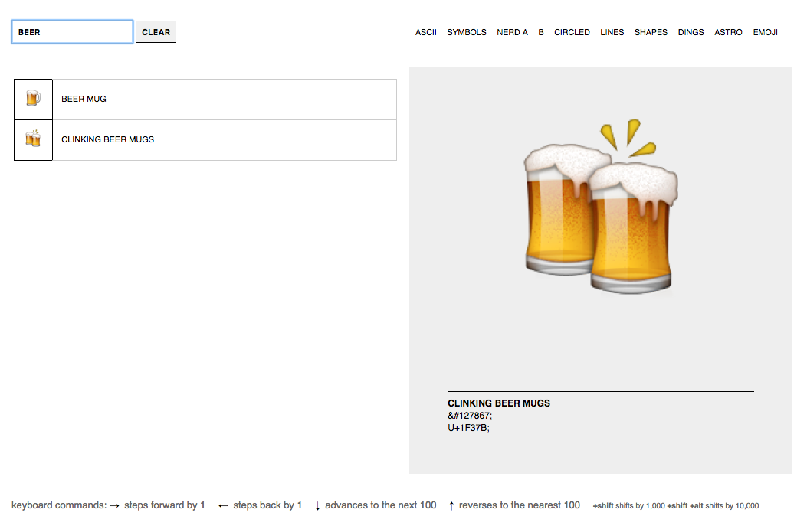

# unicode-table

`unicode-table` is a plain-vanilla, no-dependencies port of Paul Ford's [Unicode table for you](http://www.ftrain.com/unicode-table.html).

It doesn't have sliders but it does have keyboard commands and rudimentary search. Also, more recent versions of Unicode, including Unihan.

## Demo

[https://thisisaaronland.github.io/unicode-table/](https://thisisaaronland.github.io/unicode-table/)

## Usage

### In a plain old web browser

Just open `www/index.html` in your web browser.

### As a standalone application

Well almost. Everything you need to run `unicode-table` as an [Electron](https://electron.atom.io/) application is included in this repository. There are a few extra steps to get it working:

You will need to have [Git](https://git-scm.com/), [Node.js](https://nodejs.org/) and [npm](https://www.npmjs.com/) installed. On a Mac these are all easy to install with the [Homebrew](https://brew.sh/) package manager. On Linux all the dependencies are available via tools like `apt` or `yum`. On Windows I'm afraid I have no idea what the state of the art is these days.

Once all the dependencies are installed:

```
# Clone this repository
git clone https://github.com/thisisaaronland/unicode-table

# Go into the repository
cd unicode-table

# Install dependencies
npm install

# Run the app
npm start
```

## Pictures or it didn't happen

### Browsing



### Searching



## Important

This is still wet paint. It's not pretty under the hood or above but it works. At least for me.

## Where does the data come from?

Unicode and Unihan data are exported using [ucd-dump]() tool, like this:

```
./bin/ucd-dump -unihan > ~/unicode-table/www/javascript/ucd.js
```

_Note: The _ucd-dump_ program only generates a JSON-encoded dump and does not add Javascript variable declarations. I add those by hand._

## See also

* http://www.ftrain.com/unicode-table.html
* https://github.com/whosonfirst/go-ucd/
